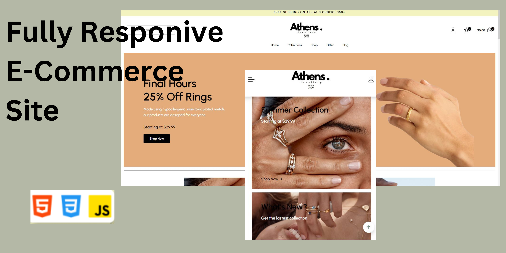

### Demo Screeshots

# Front-End eCommerce Store

This project is a front-end eCommerce store built using modern web technologies. It features a dynamic product listing, a shopping cart system, and user-friendly navigation, offering a seamless shopping experience.

## Features

- **Product Listing**: A visually appealing product grid displaying items available for purchase, with individual product pages.
- **Shopping Cart**: A fully functional shopping cart that allows users to add, remove, and update products, with real-time total cost calculation.
- **Responsive Design**: Mobile and desktop-friendly layout with a responsive grid for optimal user experience across devices.
- **Filter and Search Functionality**: Users can search for products and filter by categories to find the desired items quickly.
- **Product Details Page**: Each product has a dedicated page with detailed information, including price, description, and image gallery.
- **Checkout Process**: A streamlined checkout page to review order details and initiate the purchase.

## Tech Stack

- **Frontend**: React.js, HTML, CSS, SCSS
- **State Management**: React Context API for handling the shopping cart state and other global states
- **Styling**: SCSS for modular and scalable styles
- **Deployment**: Vercel for fast and secure hosting

## Usage

The front-end eCommerce store allows users to browse through products, view detailed information about each product, add items to their cart, and proceed to checkout. The store layout is fully responsive, providing a smooth shopping experience on both desktop and mobile devices.

## Contributing

We welcome contributions! Please follow these steps to contribute:

1. Fork the repository.
2. Create a new branch for your feature or bugfix.
3. Commit your changes and open a pull request.

## License

This project is licensed under the MIT License - see the [LICENSE](LICENSE) file for details.

## Contact

For more information or inquiries, please contact the project owner at [your-email@example.com].
